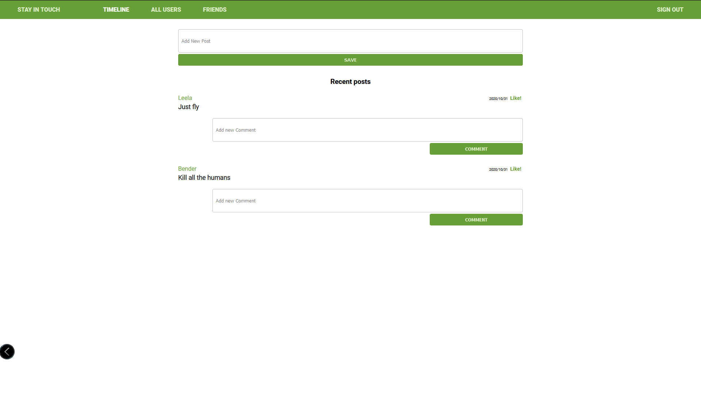
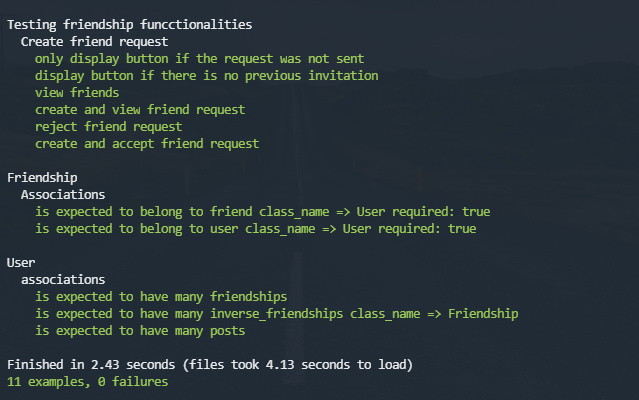

# Scaffold for social media app with Ruby on Rails



> Simple social network with the basic functionalities
 -User managment
 -Create, view, comment and like posts
 -Add friends and see your friends posts in the timeline

## Built With

- Ruby v2.7.0
- Ruby on Rails v5.2.4
## Getting Started

To get a local copy up and running follow these simple example steps.

Clone the repository to yout local machine

```
git@github.com:AdfPizarro/ror-social-scaffold.git
```
By default is configured to run with sqlite to make easy to test, however
is ready to deploy just by changing the adapter configuration to posrgress
by editing the gile confing/databse.yml

```
adapter: sqlite3
```
 to

```
adapter: postgresql
```

### Prerequisites

Ruby: 2.6.3
Rails: 5.2.3
Postgres: >=9.5

### Setup

Instal gems with:

```
bundle install
```

Setup database with:

```
   rails db:create
   rails db:migrate
```

### Usage

Start server with:

```
    rails server
```

Open `http://localhost:3000/` in your browser.

### Run tests

The tests checks the functionalities of creating and accepting friend requests
by using capybara you can run it by the followng command



```
    rspec --format documentation
```

### Deployment

TBA

## Authors

 **Adrian Flores Pizarro**

- Github: [@AdfPizarro](https://github.com/AdfPizarro)
- Twitter: [@AdfPizarro](https://twitter.com/adfpizarro)
- Linkedin: [adrian-flores-pizarro-73b62316a](https://www.linkedin.com/in/adrian-flores-pizarro-73b62316a/)

## 🤝 Contributing

Contributions, issues and feature requests are welcome!

Feel free to check the [issues page](issues/).

## Show your support

Give a ⭐️ if you like this project!

## Acknowledgments

TBA

## 📝 License

TBA
